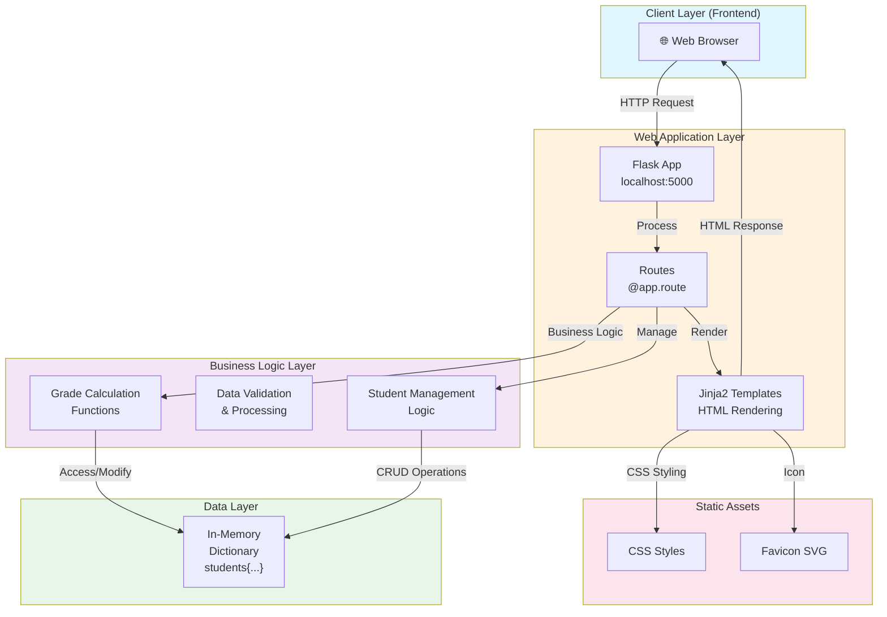
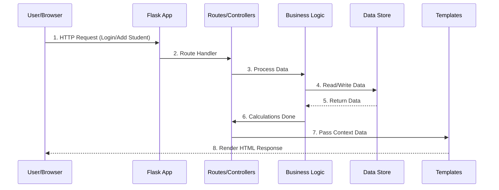
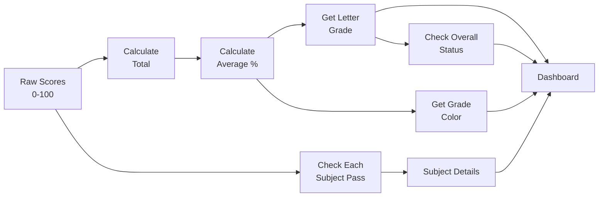

# 🏗️ Technical Architecture

## System Overview

The Student Grading System is built using a **3-Tier Architecture** pattern with Flask as the web framework. This document provides a detailed technical breakdown of the application structure.

---

## 📊 Architecture Diagram



---

## 🔄 Data Flow Diagram



---

## 📁 Project Structure

```
class9-06-05-26/
│
├── 📄 app.py                          # Main Flask Application
│   ├── Imports & Configuration
│   ├── Helper Functions (Business Logic)
│   │   ├── get_letter_grade()
│   │   ├── get_grade_color()
│   │   ├── is_passing()
│   │   └── check_overall_status()
│   ├── Sample Data (Data Layer)
│   │   └── students{} dictionary
│   └── Routes (Web Layer)
│       ├── @app.route('/')
│       ├── @app.route('/students')
│       ├── @app.route('/dashboard', POST)
│       ├── @app.route('/add-student', GET)
│       └── @app.route('/add-student', POST)
│
├── 📄 README.md                       # Project Documentation
├── 📄 technical_architecture.md       # This File
│
├── 📁 static/
│   └── favicon.svg                   # App Icon (SVG Format)
│
└── 📁 templates/
    ├── index.html                     # Home/Login Page
    ├── dashboard.html                 # Grade Display Page
    ├── add_student.html              # Add Student Form
    └── students_list.html            # All Students Directory
```

---

## 🧩 Component Architecture

### Layer 1: **Presentation Layer** (Frontend)
```
Templates/HTML Pages
├── index.html
│   ├── Gradient background
│   ├── Student ID input form
│   ├── Navigation buttons
│   └── Demo student info
│
├── dashboard.html
│   ├── Student info display
│   ├── Summary cards (Total, Average, Grade)
│   ├── Pass/Fail indicator
│   ├── Subject grade cards
│   └── Grading scale reference
│
├── add_student.html
│   ├── Personal info inputs
│   ├── 6 subject grade inputs
│   ├── Form validation
│   └── Submit & Cancel buttons
│
└── students_list.html
    ├── Students table
    ├── Quick view buttons
    └── Add new student link
```

### Layer 2: **Application Layer** (Routes/Controllers)
```
Flask Routes (@app.route)
├── / (GET)
│   └── Returns home page
│
├── /students (GET)
│   └── Returns all students list
│
├── /dashboard (POST)
│   ├── Receives student_id
│   ├── Validates student exists
│   ├── Calls business logic
│   └── Renders dashboard with data
│
├── /add-student (GET)
│   └── Returns add student form
│
└── /add-student (POST)
    ├── Receives form data
    ├── Validates inputs
    ├── Generates new student ID
    ├── Calls business logic
    └── Renders dashboard with new student
```

### Layer 3: **Business Logic Layer** (Functions)
```
Helper Functions
├── get_letter_grade(percentage)
│   ├── Input: Numeric percentage (0-100)
│   ├── Logic: Compare with thresholds
│   └── Output: Letter grade (A, B, C, D, F)
│
├── get_grade_color(percentage)
│   ├── Input: Numeric percentage
│   ├── Logic: Match grade to color
│   └── Output: Hex color code
│
├── is_passing(percentage)
│   ├── Input: Numeric percentage
│   ├── Logic: Check >= 60%
│   └── Output: Boolean (True/False)
│
└── check_overall_status(grades_dict)
    ├── Input: Dictionary of all grades
    ├── Logic: Check ALL subjects >= 60%
    └── Output: Boolean (Pass/Fail)
```

### Layer 4: **Data Layer** (Storage)
```
In-Memory Data Store
└── students (Dictionary)
    ├── Keys: Student IDs ('001', '002', etc.)
    └── Values: Student Objects
        ├── name (String)
        ├── email (String)
        └── grades (Dictionary)
            ├── Maths: Integer (0-100)
            ├── English: Integer
            ├── Telugu: Integer
            ├── Science: Integer
            ├── Commerce: Integer
            └── History: Integer
```

---

## 🔌 API Endpoints

### 1. **Home Page**
```
Method: GET
URL: http://localhost:5000/
Returns: index.html
Purpose: Display login page
```

### 2. **Student List**
```
Method: GET
URL: http://localhost:5000/students
Returns: students_list.html
Purpose: Display all students
Context: {
    'students': [
        {'id': '001', 'name': 'Alice Johnson', 'email': '...'},
        ...
    ],
    'total_students': 4
}
```

### 3. **Dashboard**
```
Method: POST
URL: http://localhost:5000/dashboard
Input: Form data {student_id: 'XXX'}
Returns: dashboard.html
Context: {
    'student_id': '001',
    'student': {...},
    'total_marks': 525,
    'average_percentage': 87.5,
    'overall_grade': 'B',
    'passing_status': True,
    'num_subjects': 6,
    'grades_with_details': {
        'Maths': {'marks': 92, 'grade': 'A', 'color': '#00c896', 'status': 'Pass'},
        ...
    }
}
```

### 4. **Add Student Form (Display)**
```
Method: GET
URL: http://localhost:5000/add-student
Returns: add_student.html
Purpose: Display form to add student
```

### 5. **Add Student (Submit)**
```
Method: POST
URL: http://localhost:5000/add-student
Input: Form data {
    'name': 'John Doe',
    'email': 'john@example.com',
    'maths': 85,
    'english': 90,
    'telugu': 88,
    'science': 92,
    'commerce': 87,
    'history': 89
}
Returns: dashboard.html (with new student)
Context: Same as /dashboard route
```

---

## 📊 Data Models

### Student Object
```python
{
    'name': str,              # Full name
    'email': str,             # Email address
    'grades': {               # Subject grades
        'Maths': int,         # 0-100
        'English': int,       # 0-100
        'Telugu': int,        # 0-100
        'Science': int,       # 0-100
        'Commerce': int,      # 0-100
        'History': int        # 0-100
    }
}
```

### Grade Details Object (Derived)
```python
{
    'marks': int,             # Raw score (0-100)
    'grade': str,             # Letter grade (A-F)
    'color': str,             # Hex color code
    'status': str             # 'Pass' or 'Fail'
}
```

### Dashboard Context Object
```python
{
    'student_id': str,
    'student': Student,
    'total_marks': int,
    'average_percentage': float,
    'overall_grade': str,
    'passing_status': bool,
    'num_subjects': int,
    'grades_with_details': dict,
    'new_student': bool (optional)
}
```

---

## 🔄 Calculation Pipeline



---

## 🎯 Key Design Patterns

### 1. **MVC (Model-View-Controller)**
- **Model**: Student data dictionary
- **View**: HTML templates
- **Controller**: Flask routes and functions

### 2. **Separation of Concerns**
- **Business Logic**: Helper functions (get_letter_grade, etc.)
- **Routing**: Flask route decorators
- **Presentation**: Jinja2 templates

### 3. **DRY (Don't Repeat Yourself)**
- Grade calculation logic reused in multiple routes
- Color assignment follows same pattern
- Pass/Fail checks consistent

### 4. **Factory Pattern**
- Auto-generation of Student IDs
- Consistent student object creation

---

## 🔐 Security Considerations

### Current Implementation
- No authentication
- No input validation (trust user input)
- No database encryption
- No HTTPS/SSL

### Recommendations for Production
```python
# Add input validation
from wtforms import Form, StringField, validators

# Add database
from flask_sqlalchemy import SQLAlchemy

# Add authentication
from flask_login import LoginManager

# Add HTTPS
# Use: python -m flask run --ssl-adhoc

# Add error handling
try-except blocks
```

---

## 📈 Performance Considerations

### Current Bottlenecks
- In-memory dictionary (no indexing)
- Linear search for student lookup
- Full recalculation on each request

### Optimization Strategies
```
Improvement          | Implementation
---------------------|----------------
Faster Lookup        | Use database with indexes
Caching              | Cache calculations
Pagination           | Limit students displayed
Lazy Loading         | Load data on demand
Database            | SQLite for small scale
                    | PostgreSQL for large scale
```

---

## 🧪 Testing Structure

### Suggested Test Cases

```python
# Unit Tests
def test_get_letter_grade():
    assert get_letter_grade(95) == 'A'
    assert get_letter_grade(85) == 'B'
    assert get_letter_grade(75) == 'C'
    assert get_letter_grade(65) == 'D'
    assert get_letter_grade(55) == 'F'

def test_is_passing():
    assert is_passing(60) == True
    assert is_passing(59) == False

def test_check_overall_status():
    passing_grades = {'Maths': 90, 'English': 80, ...}
    assert check_overall_status(passing_grades) == True
    
    failing_grades = {'Maths': 90, 'Commerce': 45, ...}
    assert check_overall_status(failing_grades) == False

# Integration Tests
def test_dashboard_route():
    # Test valid student ID
    # Test invalid student ID
    # Test calculation accuracy

def test_add_student_route():
    # Test form submission
    # Test ID generation
    # Test data persistence
```

---

## 🚀 Deployment Architecture

### Development
```
Local Machine
├── Python 3.x
├── Flask development server (port 5000)
└── In-memory data store
```

### Production (Recommended)
```
Web Server
├── Gunicorn/uWSGI (WSGI server)
├── Nginx (reverse proxy)
├── SSL/TLS certificates
└── PostgreSQL database
```

### Docker (Optional)
```dockerfile
FROM python:3.9
WORKDIR /app
COPY . .
RUN pip install -r requirements.txt
EXPOSE 5000
CMD ["python", "app.py"]
```

---

## 📦 Dependencies

### Required
```
Flask==2.3.0          # Web framework
Jinja2==3.1.0         # Template engine
```

### Optional (for production)
```
Flask-SQLAlchemy      # Database ORM
Flask-Login           # Authentication
Gunicorn              # WSGI server
python-dotenv         # Environment variables
```

---

## 🔄 Request-Response Cycle Example

### Scenario: View Student Dashboard

```
1. USER ACTION
   └─> User enters Student ID "001" and clicks "View Dashboard"

2. HTTP REQUEST
   └─> POST /dashboard
       Form Data: {student_id: "001"}

3. FLASK PROCESSING
   └─> @app.route('/dashboard', methods=['POST'])
       └─> dashboard() function called

4. ROUTE HANDLER
   └─> student_id = request.form.get('student_id')
   └─> Validate if student_id in students dict
   └─> If found: proceed to calculations
   └─> If not found: return error page

5. BUSINESS LOGIC EXECUTION
   └─> student = students['001']
   └─> total_marks = sum(student['grades'].values())
       │            = 92+85+88+90+87+89 = 531
   └─> average_percentage = 531 / 6 = 88.5
   └─> overall_grade = get_letter_grade(88.5) = 'B'
   └─> overall_status = check_overall_status(grades)
   │                  = All subjects >= 60? Yes = True
   └─> For each subject:
       ├─> grade = get_letter_grade(marks)
       ├─> color = get_grade_color(marks)
       └─> status = is_passing(marks)

6. CONTEXT PREPARATION
   └─> Create context dictionary with all calculations
   └─> {
           'student_id': '001',
           'student': {...},
           'total_marks': 531,
           'average_percentage': 88.5,
           'overall_grade': 'B',
           'passing_status': True,
           'grades_with_details': {...}
       }

7. TEMPLATE RENDERING
   └─> render_template('dashboard.html', context_data)
   └─> Jinja2 processes {{ }} variables
   └─> CSS styling applied

8. HTTP RESPONSE
   └─> Complete HTML sent to browser
   └─> Status: 200 OK

9. BROWSER RENDERING
   └─> HTML parsed
   └─> CSS applied
   └─> JavaScript executed (if any)
   └─> Page displayed to user
```

---

## 📊 Database Schema (Future Enhancement)

```sql
-- Students Table
CREATE TABLE students (
    student_id VARCHAR(3) PRIMARY KEY,
    name VARCHAR(100) NOT NULL,
    email VARCHAR(100) UNIQUE,
    created_at TIMESTAMP DEFAULT CURRENT_TIMESTAMP
);

-- Grades Table
CREATE TABLE grades (
    id INT PRIMARY KEY AUTO_INCREMENT,
    student_id VARCHAR(3) NOT NULL,
    subject VARCHAR(50) NOT NULL,
    marks INT(3) NOT NULL,
    grade_letter VARCHAR(1),
    FOREIGN KEY (student_id) REFERENCES students(student_id)
);

-- Create Indexes
CREATE INDEX idx_student_id ON grades(student_id);
CREATE INDEX idx_subject ON grades(subject);
```

---

## 🎨 Frontend Architecture

### CSS Organization
```
Styles
├── Global Styles
│   ├── Reset & Base
│   └── Typography
├── Component Styles
│   ├── Cards
│   ├── Forms
│   ├── Buttons
│   └── Tables
└── Page-Specific
    ├── Home/Login
    ├── Dashboard
    ├── Add Student
    └── Student List
```

### Color Scheme
```
Primary Colors:
├── Purple (#667eea) - Main theme
├── Dark Purple (#764ba2) - Accents
└── Light Gray (#f8f9fa) - Backgrounds

Grade Colors:
├── Green (#00c896) - Grade A (90-100%)
├── Blue (#667eea) - Grade B (80-89%)
├── Orange (#f5a623) - Grade C (70-79%)
├── Light Orange (#ff9f43) - Grade D (60-69%)
└── Red (#e74c3c) - Grade F (below 60%)

Status Colors:
├── Green (#28a745) - PASS
└── Red (#dc3545) - FAIL
```

---

## 🔍 Error Handling

### Current Implementation
```python
# Basic error handling
if student_id in students:
    # Process
else:
    # Return error message
```

### Recommended Improvements
```python
# Enhanced error handling
try:
    student = students[student_id]
    marks = int(request.form.get('marks'))
except KeyError:
    return render_template('error.html', 
                         error='Student not found')
except ValueError:
    return render_template('error.html',
                         error='Invalid marks input')
except Exception as e:
    return render_template('error.html',
                         error='Unexpected error')
```

---

## 📝 Configuration Management

### Current (Development)
```python
app = Flask(__name__)
app.run(debug=True, port=5000)
```

### Recommended (Production)
```python
import os
from dotenv import load_dotenv

load_dotenv()

class Config:
    DEBUG = os.getenv('DEBUG', False)
    DATABASE_URL = os.getenv('DATABASE_URL')
    SECRET_KEY = os.getenv('SECRET_KEY')
    PORT = os.getenv('PORT', 5000)
```

---

## 🎓 Learning Outcomes

This architecture demonstrates:
- ✅ MVC pattern implementation
- ✅ RESTful route design
- ✅ Template rendering (Jinja2)
- ✅ Business logic separation
- ✅ Data modeling
- ✅ Grade calculation algorithms
- ✅ HTML form handling
- ✅ CSS responsive design
- ✅ In-memory data structures

---

**Last Updated:** June 2026  
**Architecture Version:** 1.0  
**Status:** Production Ready (Development Phase)
